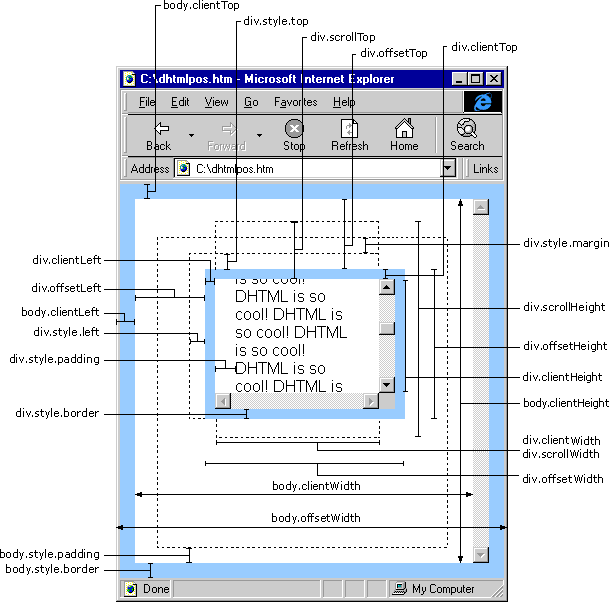

# JavaScript

## 前段历史

1. 从C/S到B/S (网页制作) (HTML/CSS)
  + 技术栈：photoshop, HTML, CSS
2. 从静态到动态，从后端到前段 (js/jQuery/Ajax)
  + 前段端分离
    - 后台：完成数据的分析和业务逻辑编写（包含API接口编写）
    - 前段：网页制作，JS交互效果，数据的交互和绑定 
  + 技术栈：JavaScript, Ajax, jQuery ...
3. 从前段到全端(从PC端到移动端) (Hybrid/小程序)
  + 技术栈：H5, CSS3, 响应式布局开发, zepto, Hybrid(混合APP开发), 微信小程序
4. 从全端到全栈 (React/Vue/Webpack/Node)
  + 全栈开发：一种语言前后端都可以开发
  + 技术栈：Node(基于JS编程语言开发服务端)， **Express/Koa**
  + 高性能框架：**Vue、React、Angular、webpack**

5. web4.0 **VR/AR**元年，需要 **Canvas/WebGL**

未来软件工程师：端工程师(业务逻辑工程师)/云工程师(数据工程师)

## IDE

> Integrated Development Enviroment 集成开发环境

1. dreamweaver/firefox/photoshop/flash
2. sublime text
3. HBuilder
4. webstorm
5. atom
6. vim
7. Visual Studio Code

## browser kernel

1. **Webkit** kernel(V8 引擎) chrome/safari/opera/大部分国产和手机浏览器
2. **Gecko** kernel (Mozilla Firefox)
3. **Presto** kernel
4. **Trident** 排版引擎 (Internet Explorer)
5. **KHTML** 排版引擎

- 大部分网站都已放弃IE8以及更低版本浏览器（例如：淘宝）
- W3C: 万维网联盟，制定编程语言的规范和标准
- 开发者按照规范编写代码，浏览器开发商也会开发一套按照规范吧代码渲染成页面的东西（内核或者引擎）

- 浏览器内核作用：按照规范，把代码基于GPU（显卡）绘制出对应的图像和页面

### 为什么出现浏览器兼容？
 
1. 部分浏览器提前开发一些**更好体验的功能**，后期这些功能会**被收录到W3C规范**中，但是在**收录之前**，会存在一定的**兼容性**。
- `-webkit-border-radius`
- `-moz-border-radius`
- `-ms-border-radius`
- `-o-border-radius`
- `border-radius`

2. 各个浏览器厂商，突出自己产品独特性，用其他方法实现了W3C规范中的功能
- `getComputedStyle`
- `currentStyle`

[马克飞象](https://maxiang.io/)

## JavaScript Structure

- ECMAScript(语法规范) 描述语言的语法和对象
- DOM(文档对象模型) 描述网页内容的方法和接口
- BOM(浏览器对象模型) 描述与浏览器进行交互的方法和接口

- 标记语言：html/css, xml
- 脚本语言：javascript/python/php
- 编程语言：java/go

- 推荐阅读书籍：
  - 《JavaScript权威指南》
  - 《JavaScript高级程序设计》
  - 《你所不知道的JavaScript》
  - 《ES6标准入门》

## Variable

> 存储值的容器或者代名词，因为它存储的值可以改变，所以称为变量

### ES 语言规范 —— 创建变量

- `var` (ES3)
- `function` (ES3) 创建函数（函数名是变量，只不过存储的值是函数类型）
- `let` (ES6) 创建声明局部变量
- `const` (ES6) 创建常量
- `import` (ES6) 模块规范导出信息
- `class` (ES6) 创建类

``` js
语法：
var [变量名] = 值;
let [变量名] = 值;
const [常量名] = 值;
function 函数名 () {
  函数体...
}

const PI = 3.14
PI = 3.1415
Uncaught TypeError: Assignment to constant variable. 未捕获的错误类型: 赋值给常量
```

### 变量命名规范

- 严格区分大小写
- 遵循驼峰命名法
- 数字、字母、下划线和美元符号($)命名
- 数字不能作为开头
- 命名语义化 
- 不能使用关键字和保留字

- 常用规范
  - `_num` 内部或私有变量
  - `$obj` DOM对象变量
  - add / create / insert
  - del (delete) / update / remove (rm)
  - info / detail
  - log

## Data Type

### Date Type Category

- 基本数据类型
  - 数字 `Number`
  - 布尔 `Bool`
  - 字符串 `String`
  - 空引用 `null`
  - 未命名 `undefined`
- 引用数据类型
  - object
    - 普通对象
    - 数组对象
    - 正则对象
    - 日期对象
   - 函数 function
- `Symbol`(ES6) 唯一的值

`NaN` (Not a number) 不是一个有效的数字，但是属于number类型


```js
var a = Symbol('唯一');
var b = Symbol('唯一');
a == b // false
a // Symbol(唯一)
b // Symbol(唯一)
```

判断数据类型 {undefined|number|string|boolen|object(包括 null, array, object, function, dom)} `String typeof VARIABLE`

### Number

#### NaN: not a number  但是它是数字类型的

isNaN(v) 检测当前值是否不是有效数字，返回true代表不是有效数字，返回false时有效数字

```js
语法：boolean isNaN([value]);
var num = 12;
isNaN(num); // false
isNaN('13'); // false
isNaN('wovert'); // true
isNaN(true); // false
isNaN(false); // false
isNaN(null); // false
isNaN(undefined); // true
isNaN({xx:9}); // true
isNaN([12,33]); // true
isNaN([12]); // false
isNaN(/^$/); // true
isNaN(function(){}); // true

重要：isNaN检测的机制

1. 首先验证当前要检测的值是否为数字类型的，如果不是，浏览器会默认的把值转换为数字类型

非数字类型的值转换为数字

  其他基本类型转换为数字： 直接使用Number这个方法转换的

    [字符串转数字]
      Number('88') => 13
      Number('13px') => NaN 如果当前字符串中出现任意一个非有效数字字符，结果则为 NaN
      Number('13.5') => 13.5 可以识别小数
      Number('13.5.0) => NaN

    [布尔转数字]
      Number(true) => 1
      Number(false) => 0

    [其他]
      Number(null) => 0
      Number(undefined) => NaN


  引用数据类型转换为数字： 先把引用值调取toString转为字符串，然后再把字符串调取Number转换为数字

    [对象]
      ({}).toString() => '[object Object]' => NaN

    [数组]
      [12,23].toString() => '12,23' => NaN
      [12].toString() => '12' => 12

    [正则]
      /^$/.toString() => '/^$/' => NaN

  Number('') => 0
  [].toString() => '' => false


2. 当前检测的值已经是数字类型，是有效数字返回false, 不是返回true (数字类型中只有NaN不是有效数字，其余都是有效数字)

```

#### parseInt/parseFloat

> 等同于Number, 其他类型的值转换为数字类型
> 和 Number 的区别在于字符串分析上
> Number: 出现任意非有效数字字符，结果就是NaN
>
> parseInt(): 把一个字符串中的前缀整数部分解析出来，parseFloat() 是一个字符串中的前缀浮点数部分解析出来

```js
parseInt('13.5px') => 13
parseFloat('13.5px') => 13.5

parseInt('width:30px') => NaN 从字符串最左边开始查找有效数字字符，并且转换为数字，但是一旦遇到一个非有效数字字符，查找结束


```

#### NaN的比较

```js
NaN == NaN => false NaN和谁都不相等，包括自己
```

思考题：有一个变量num, 存储的值不知道，检测它是否为一个有效数字

```js
if (Number(num) == NaN) {
  console.log('num不是有效数字')
}

NaN和谁都不相等，条件永远不成立（即时num确实不是有效数字，转换的结果确实是NaN， 但是NaN!=NaN的）


解决方案：
if (isNaN(Number(num)) {
  console.log('num不是有效数字')
}
```


### Sting

- 属性
  - Integer `str.length`: 返回字符串长度
- 方法
  - Char `str.charAt(3)`: 返回索引所在位置的字符

### 数据类型转换

``` js
Number(a) 返回数值或 NaN
parseInt(a)
parseFloat(a)
isNaN(a) : is not a number
```

### JS 如何被运行

- 在浏览器内核渲染解析
- 基于Node环境运行（V8 引擎渲染和解析JS）

### 调试技巧

- `console.log()` 输出日志
- `console.dir()` 比log输出的更加详细一些
- `console.table()` json数据按照表格的方式输出

## scope

- 作用域
- 域：空间、范围、区域

### JS 解释器

1. 查找 var 和 function 参数，遇到重名的只留下最后一个 - JS的预解析
2. 逐行解读代码 - 表达式

### boolean

> boolean={true,false}

其他数据类型转换为boolean

- `Boolean()`
- `!`
- `!!`

```js
!0 => true
!'' => true
Boolean(1) => true
!'沃尔特' => false 先把其他数据类型转换为布尔类型，然后取反

!![] => true
!!{} => true

!!null => false
!!undefiend => false
!!'' => false
!!0 => false
!!NaN => false
```

总结：在JS中只有`0、NaN、空字符串、null、undefined`这个五个值转换为布尔类型的`false`, 其余都转换为`true`

### null && undefined

> 都代表空或者灭有
> `null`: 空对象指针
> `undefined`: 未定义

`null` 一般都是意料之中的没有(先手动设置为null, 后面再次给它其他值)

```js
var num = null; // => null 手动赋值
num = 88;
```

`undefined` 代表没有一般都不是认为手动控制的，大部分都是浏览器自主为空（后面可以赋值也可以不赋值）

```js
var name; // 此时变量的值浏览器给分配的就是 undefined
...
后面可以赋值也可以不赋值

Number(null) => 0
Number(undefined) => NaN
```

### Object 对象数据类型

> 普通对象
> - 由大括号包裹起来的
> - 由零到多组属性名和属性值（键值对）组成

- 属性：描述当前对象的特征
- 属性名：当前具备这个特征
- 属性值：对这个特征的描述

属性名称为键`[key]`，属性值称为值`[value]`，一组属性名和属性值称为一组键值对儿

```js
var obj = {
  name: 'wovert',
  age: 1
};

对象的操作：CRUD

[READ]
语法：对象.属性 / 对象[属性]

obj.name
obj['name'] 或 obj["name"] 一般来说，对象的属性名都是字符串格式的（属性值不固定，任何格式都可以）


[CREATE/UPDATE]
JS对象中属性是不允许重复的，是唯一的

var obj1 = {name: 'one object'};
var obj2 = {name: 'two object'};
obj1.age = 10; // 原有对象中不存在age, 此处相当于当前对象新增加一个属性 age
obj2['age'] = 20

[DELETE]
彻底删除：对象中不存在这个属性
delete obj['age'];

假删除：没有移除这个属性，只是让当前属性的值为空
obj.sex = null;
```

获取属性值的时候，如果当前对象有这个属性名，则可以正常获取到值(也有可能是 `null` 值)，但是如果没有这个属性名，则获取的结果是 `undefined`

```js
obj['color']; // undefined
```

## style

``` js
ele.style.float = 'left';
ele.style.cssFloat = 'left'; // 非IE
ele.style.styleFloat = 'left'; // IE
```

``` js
. 替换成 []
ele.style.styleAttr = value;
ele.style[styleAttr] = value;
```

``` js
css 内联样式
ele.style.cssText = 'width:200px;height:200px';
```

``` js
后去到浏览器计算后的样式(IE8/7/6 低版本有问题)
getComputedStyle($('box').width 

支持 IE8/7/6，标准浏览器不兼容
$('box').currentStyle.width
```

## event

- onmouseover() 鼠标移入事件。mouse 从外部移入到当前元素时触发
- onmouseout() 鼠标移除事件。mouse 从当前元素移除时触发
- onmousedown() 鼠标按下时事件
- onmouseup() 鼠标被松开
- onmousemove() 鼠标被移动
- onload() 页面加载成功触发
- onsubmit() 提交按钮被点击
- onclick() 元素单击事件
- ondblclick() 元素双击事件
- onfocus() 元素聚焦事件
- onblur() 元素离焦事件
- onchange() 元素改变域的内容事件
- onabort() 图像加载被中断
- onerror() 当加载文档或图像时发生某个错误
- onkeydown() 某个键盘被按下
- onkeyup() 某个键盘松开
- onkeypress() 某个键盘被按下或按住
- onreset() 重置按钮
- onresize() 窗口或看框架被调整尺寸
- onselect() 文本被选定

### event对象

> 当一个事件发生的时候，和当前这个对象发生的这个事件有关的详细信息被临时保存到一个指定地方 event对象

- IE/Chrome event是一个内置全局对象
- W3C: 事件对象是通过事件函数的第一个参数传入

如果一个函数是被事件调用的，那么这个函数定义的第一个参数就是事件对象

- 事件对象必须在一个事件调用的函数里面使用才有内容
- 事件函数：事件调用的函数，一个函数是不是事件函数，不在定义时候决定，而是取决于这个调用的时

```js
obj.onclick = function(ev){
  var ev = ev || event;
  // e.clientX/Y 事件发生的时候，鼠标到页面可视区的距离
}

document.onmouseover = function(ev) {
  var ev = ev || event;
  var scrollTop = document.documentElement.scrollTop || document.body.scrollTop;
  obj.style.left = ev.clientX + 'px';
  obj.style.top = ev.clientY + scrollTop + 'px';
}
```

### 事件流

- 事件冒泡
  - 当一个元素接收到事件的时候，会把它接受到的所有传播给他的父级，一直到window
  - 阻止冒泡：`ev.cancleBubble = true` 阻止当前对象的当前事件的冒泡

- 事件捕获：
  - IE下没有，在绑定实践中，W3C下有的

### 事件绑定

- IE：obj.attachEent('on事件名', 事件函数)
  - 没有捕获
  - 事件名 on前缀
  - 事件函数执行的顺序：W3C
  - 事件执行的顺序是倒序
- W3C: obj.addEventListener('事件名', 事件函数, 是否捕获); // 是否捕获：默认 false：冒泡，true：捕获
  - 有捕获
  - 事件名没有前缀
  - 事件执行的顺序是正序
  - this触发该事件的对象

``` js
function bind(obj, eventName, fn) {
  if (obj.addEventListener()) {
    obj.addEventListener(eventName, fn, false)
  } else {
    obj.attachEvent('on'+eventName, function() {
      fn.call(obj);
    })
  }
}
function unbind(obj, eventName, fn) {
  if (obj.remvoeEventListener()) {
    obj.removeEventListener(eventName, fn, false)
  } else {
    obj.detachEvent('on'+eventName, function() {
      fn.call(obj);
    })
  }
}
```

## DOM

> DOM is Document Ojbect Model(文档对象模型)

- Document: HTML page
- Document Object: page's elemnt
- Document Object Model: Use JavaScript code Manipulate the elements in the page

DOM is tree type structure

- document
  - html
    - head
      - title
    - body
      - ul
        - li

## [Node Type](https://www.w3.org/TR/2000/REC-DOM-Level-2-Core-20001113/DOM2-Core.txt)

- Element Node:1
- Attribute Node:2
- Text Node:3

- Parent Node
- Children Node
- First Node
- Last Node
- Previous Node
- Next Node

### document object

#### document method

- `document.getElementById('id')` get 获取某个元素
- `document.getElementByName('name')` 返回名称对象集合
- `document.getElementsByTagName('tag')` 返回带有指定标签对象集合
- `documente.write|writeln()` 向文档写 html 表达式或 javascript 代码
- `document.createTextNode()` 创建节点
- `document.createElement()` 创建元素节点

### Element method

- `element.appendChild()` 向元素添加新的节点，作为最有一个子节点
- `element.getAttribute('attribute')` 返回只读的元素的属性值
- `element.setAttribute('attribute', 'value')` 设置元素的属性值
- `element.innerHTML` 设置或返回元素的内容
- `element.offsetHeight()` 网页尺寸(不包含滚动条)
  - `document.body.offsetWidth || document.documentElement.offsetWidth`
- `element.scrollHeight()` 网页尺寸(包含滚动条)
- `element.insertBefore(new_ele, 指定的元素)` 在指定已有的节点之前插入新节点


在 ie 下如果第二个参数的节点不存在，会报错

在其他标准浏览器下第二个参数不存在，则会以appendChild 的形式进行插入添加

``` js
if (ele.children[0]) {
  ele.insertBefore(new_child, ele.children[0]);
} else {
  ele.appendChild(new_child);
}
```

- `parent_ele.replaceChild(new_node, replace_node);`
- `parent_ele.removeChild(delete_node)`

#### Element attribute

`element.childNodes` 只读一级子节点列表集合(所有[节点类型](https://www.w3.org/TR/2000/REC-DOM-Level-2-Core-20001113/DOM2-Core.txt))

- 标准：包含了元素和文本(换行)类型的节点，包含非法嵌套的子节点
- 非标准(IE)：只包含了元素类型的节点， IE7- 元素节点(ul)下包含非法节点(p)时，childNodes不包含非法节点(p)

`element.children` 只读一级子节点列表集合

- 标准：只包含元素类型的节点
- 非标准：只包含元素类型的节点

`element.nodeType` 只读当前元素的节点类型

`element.attributes` 只读当前元素属性列表集合

`element.attributes[0].nodeType == 2`

`element.attributes[0].id` 属性值

`element.firstChild` 返回只读元素的首个子节点

标准：firstChild 会包含文本类型的节点
非标准：只包含元素节点

`element.firstElementChild` 返回只读元素的首个子节点（标准）

非标准IE不支持firstElementChild

``` js
if (ele.firstElementChild) {
  ele.firstElementChild.style.background = 'red;
} else {
  ele.firstChild.sytle.background = 'red';
}
var ele = ele.firstElementChild || ele.firstChild;
ele.style.background = 'red';
```

``` js
<ul id="list"> </ul>
var ele = document.getElementById('list');
var eleChild = ele.firstElementChild || ele.firstChild;
IE9下 eleChild 是文本节点

解决方案：
if (ele.children[0]) {
  ele.children[0].style.background = 'red';
}
```

- `element.lastChild` 返回只读元素的最后一个子节点
- `element.lastElementChild` 返回只读元素的最后一个子元素
- `element.nextSibling` 返回只读元素的下一个兄弟节点
- `element.nextElementSibling` 返回只读元素的下一个兄弟元素
- `element.previousSibling` 返回只读元素的上一个兄弟节点
- `element.previousElementSibling` 返回只读元素的上一个兄弟元素

上一个或下一个节点有可能是文本节点如何处理？

- `ele.parentNode` 当前元素的只读父节点
- `ele.offsetParent` 当前元素的只读离当前元素最近的一个有定位的父节点，没有定位，则默认body

IE7 下如果当前元素没有定位默认是body, 如果有定位，则是html

IE7下，如果当前元素的某个父级触发了 layout, 那么 offsetParent 就会指向到了这个触发了 layout 特性的父节点上

IE 7: `ele.currentStyle.hasLayout` 当前元素是否触发 layout (父元素css 样式 zoom:1，会返回 true，否则返回 false)

### offset

`ele.offsetLet` 只读属性，当前元素到定位父级的距离（偏移值），到当前元素的 `offsetParent` 的距离

- 如果没有定位父级
  - offsetParent -> body / IE7
  - offsetParent -> html

- 如果有定位父级
  - IE7 以下：如果自己没有定位，那么offset{Left|Top}是到 body 的距离
  - 其他：到定位父级的距离

- 如果自己有定位，那么就是到定位父级的距离

IE7 以下，如果自己没有定位，则 offsetLeft, offsetTop 的 body 的距离，如果当前元素有定位，则到当前元素的 `offsetParent` 的距离

`ele.offsetTop`

### 元素宽高

- ele.style.width: 样式宽度(width+px)
- ele.clientWidth: 可视区域 // 样式宽度+padding
- ele.offsetWidth: 占位宽度 // 样式宽度+padding+border

### table node

``` js
tObj.tHead[0].rows.length 行数
tObj.tBodies[0].rows[0].cells.length 列数
tObj.tFoot[0].rows[i].style.backgroundColor = '#000' 单元格
```

## window 对象

### window Attribute

- window.innerHeight 浏览器矿口的内部高度
- window.innerWidth 浏览器矿口的内部宽度

### window method

- window.open() 打开新窗口
- window.close() 关闭当前窗口
- window.setInterval(fn, time)
- widnow.clearInterval(ref)
- window.setTimeout(fn, time)
- window.clearTimout(ref)

## history 对象

> winodow.history 对象包含浏览器的历史(url)集合

### history method

- history.back()
- history.forward()
- history.go(+-{n})

## location 对象

> 获得当前页面的地址（URL）,并把浏览器重定向到新的页面

### location attribute

- location.hostname 主机域名
- location.pathname 页面的路径和文件名
- location.port 端口
- location.protocol 协议
- location.href 当前页面URL

### location method

- location.assign() 加载新的文档
- location.reload() 重新载入
- location.replace() 替换页面(不记录history)

## screen 对象

> 包含有关用户屏幕的信息

### screen attribute

- `screen.availWidth` 可用的屏幕宽度
- `screen.availHeight` 可用的屏幕高度
- `screen.height` 屏幕高度
- `screen.width` 屏幕宽度

## String

### String Attribute

`str.length`

### String Method

- `str.charAt([-]?[0-9]+)` : 索引位置的字符，索引0开始; -从右到左(-1开始)
- `str.charCodeAt(0)` : 返回索引位置字符编码(妙=>22937)，没有字符则默认使用索引0的字符；{0-9=>48-57, A-Z=>65-90, a-z=>97-122}
- `str.indexOf(字符或字符串, [stratIndex])` : 返回字符所在索引位置，找不到字符则返回-1
- `str.lastIndexOf('字符或字符串', [startIndex])` : 从右到左搜索，第二个值为负数，默认当成0处理
- `"-a-b-c-d-e-f-".substr(2, 4)` : -b-c 从起始索引号提取字符串中指定数目的字符
- `"-a-b-c-d-e-f-".substring(2, 4)` : -b 提取字符串中两个指定索引号之间的字符, 第一个参数为负数时，当0处理
- `arr.slice(-2, 4)` 返回一个新的数组，包含从 start 到 end （不包括该元素）的 arrayObject 中的元素
- `str.toUpperCase()` 转换成大写
- `str.toLowerCase()` 转换成小写
- `str.split('分隔符')` 返回字符串指定分割的数组
- `arr.join([分隔符])` 返回按照分隔符数组合并成字符串

``` js
str.split(separator).join('<span>' + separator + '</span>');
```

### String Static Method

- `String.fromCharCode(22937, 21619)` : 返回字符编码所对应的字符(22937=>妙, 21619=>味)

``` js
/************ 加密 **********/
var str = "加密文本";
var cnt = str.length;
var str_encrypt = '';
for(var i=0; i<cnt; i++) {
  str_encrypt += String.fromCharCode(str.charCodeAt(i)-520);
}
console.log(str_encrypt);
```

## Global Function

encodeURI(str) // 中文

encodeURIComponent(str); // [:/] 也会编码

## time

> 系统时间对象

``` js
var curDate = new Date(); 当前系统的时间对象
typeof curDate == 'object'; // true
var iY = curDate.getFullYear();
var iM = curDate.getMonth() + 1;
var iD = curDate.getDate();
var iW = curDate.getDay(); // 0-6:星期日-星期六
var ih = curDate.getHourse();
var im = curdate.getMinutes();
var is = curDate.getSeconds();

/************* 倒计时 *************/
// 数字形式：new Date(YYYY,MM,DD,hh,mm,ss);
// 字符串形式：new Date('June 10, 2013 12:12:12')
var nowDate = new Date(); // 现在时间点（在变）
var newDate = new Date('2018,10,20, 18,18,18'); // 未来时间点（不变）

var distance = Math.floor((newDate-nowDate)/1000); // 时间差毫秒转换为秒

var dD = Math.floor(distance/86400); // 天
var dH = Math.floor(distance%86400/3600); // 时
var dM = Math.floor(distance%86400%3600/60); // 分
var dS = Math.floor(distance%60); // 秒

```

## Array

### Array Attribute

- arr.length

### Array Method

- `arr.push(ele)` 追加到最后
- `arr.unshift(ele)` 追击到最前（IE 6/7 不支持 返回值）
- `arr.pop()` 弹出最后元素
- `arr.shift()` 弹出之前元素
- `arr.splice(0,3,替换字符串或数组)`
- `arr.sort()` ASCII 排序

``` JS
arr.sort(function(a,b){
  return parseInt(b)-parseInt(a);
})
```

## Math

- `Math.random()` // 0~1
- `Math.random()*5 + 5` // 5~10
- `Math.round()`
- Math.ceil()
- Math.concat()
- Math.reverse()

## 异常捕获

- 异常： JS引擎执行JavaScript代码的时候，发生了错误，导致程序停止运行
- 异常抛出：当异常产生，并且将这个异常生成一个错误信息

- 异常捕获
  - try{发生异常的代码块} catch(err) {错误信息处理;}
- throw语句：通过throw 语句创建一个自定义错误

## 元素对象属性

- ele.className

## 窗口尺寸与大小

- 可视区尺寸: 窗口内内容显示的最大区域
  - document.documentElement.clientWidth
  - document.documentElement.clientHeight
- 滚动高度：内容向上或向左
  - document.body.scrollTop/scrollLeft
  - document.documentElement.scrollTop/scrollLeft
  - document.documentElement.scrollTop/scrollLeft || document.body.scrollTop/scrollLeft\

``` js
当前页面的滚动条纵坐标位置
document.documentElement.scrollTop;
而不是：document.body.scrollTop;
documentElement 对应的是 html 标签，而 body 对应的是 body 标签。

在标准w3c下，document.body.scrollTop恒为0，需要用document.documentElement.scrollTop来代替;
如果你想定位鼠标相对于页面的绝对位置时，你会发现google里面1000篇文章里面有999.99篇会让你使用event.clientX+document.body.scrollLeft，event.clientY+document.body.scrollTop，如果你发现你的鼠标定位偏离了你的想象，请不要奇怪，这是再正常不过的事情。
ie5.5之后已经不支持document.body.scrollX对象了
所以在编程的时候，请加上这样的判断
if (document.body && document.body.scrollTop && document.body.scrollLeft)
{
    top=document.body.scrollTop;
    left=document.body.scrollleft;
}
if (document.documentElement && document.documentElement.scrollTop && document.documentElement.scrollLeft)
{
    top=document.documentElement.scrollTop;
    left=document.documentElement.scrollLeft;
}
```

- 内容高度
  - document.body.scrollHeight
  - elementObj.scrollHeight (eleObj元素对象内容的高度， padding+height+padding)
- 文档高度
  - document.documentElement.offsetHeight
  - document.body.offsetHeight

  - 文档高度=margin+border+padding+height+padding+border+margin



- clientHeight：元素客户区的大小，指的是元素内容及其边框所占据的空间大小（经过实践取出来的大多是视口大小）
- scrollHeight: 滚动大小，指的是包含滚动内容的元素大小（元素内容的总高度）
- offsetHeight: 偏移量，包含元素在屏幕上所用的所有可见空间（包括所有的内边距滚动条和边框大小，不包括外边距

document.body和document.documentElement，同样的属性用document.body和document.documentElemen表达出来可能会截然不同。

- body是DOM对象里的body子节点，即 <body> 标签；
- documentElement 是整个节点树的根节点root，即<html> 标签；
- DOM把层次中的每一个对象都称之为节点，就是一个层次结构，你可以理解为一个树形结构，就像我们的目录一样，一个根目录，根目录下有子目录，子目录下还有子目录。
- 以HTML超文本标记语言为例：整个文档的一个根就是,在DOM中可以使用document.documentElement来访问它，它就是整个节点树的根节点。而body是子节点，要访问到body标签，在脚本中可以写：document.body。
- 除了documentElement，body在浏览器下表现方式的不同和各个浏览器对这三个属性的解释不同，ie下的混杂模式和标准模式也来插了一脚。

### jquery

在jQuery中，`width()`方法用于获得元素宽度；`innerWidth()`方法用于获得`包括内边界（padding）的元素宽度，outerWidth()方法用于获得包括内边界(padding)和边框(border)的元素宽度`，如果`outerWidth()`方法的参数为true则`外边界`(margin)也会被包括进来，即获得包括外边框(margin)、内边界(padding)和边框(border)的元素宽度。同理，innerHeight方法与outerHeight方法也是用同样的方法计算相应的高度。

所以说：对于同一个元素应该是：`width()<=innerWidth()<=outerWidth()<=outerWidth(true);`
